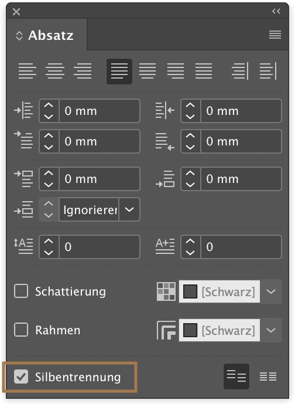
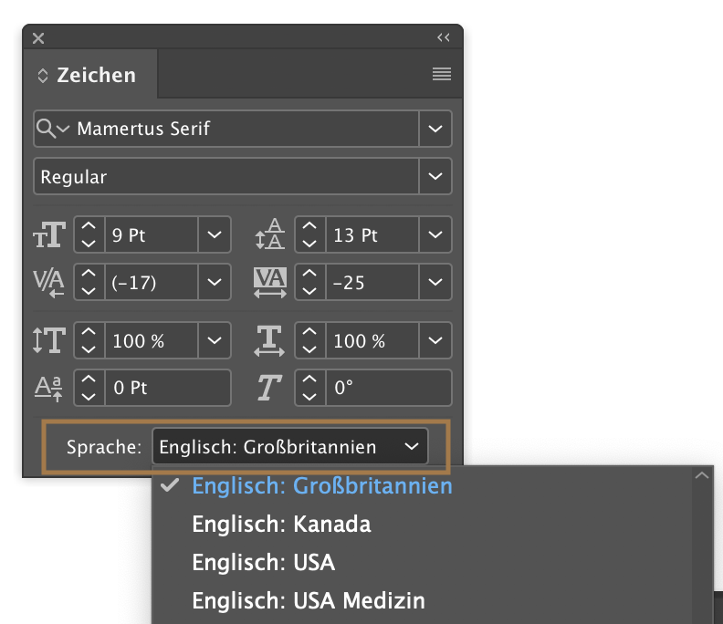
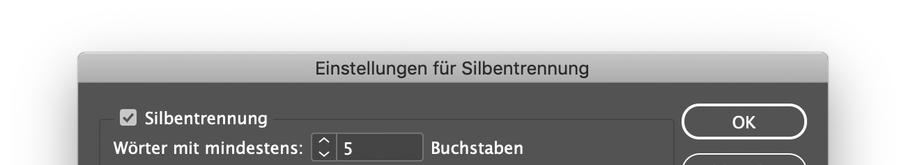
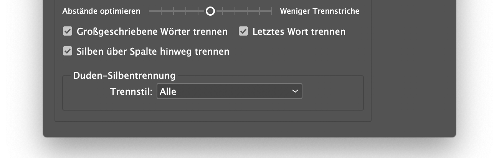

## Typo: Praxis

### Silbentrennung

**Wichtig:** Die Silbentrennung ist immer abhängig von der im Absatzformat eingestellten Sprache!

im Absatz Bedienfeld Aktivieren: | Im Zeichen Bedienfeld die Sprache einstellen:
---|---
 | 
```
Nachdem die Silbentrennung aktiviert ist müssen wir müssen noch individuelle Einstellungen, die sich je nach Layout richten sollten, vorgenommen werden. Unter `Absatz` → Aufklappmenü  → Silbentrennung 
```

Bei engen Spalten macht eine Wortlänge von 5 Buchstaben Sinn. Möchte man keine kurze Vor-/Nachsilbentrennung, so sind mindestens 6 Buchstaben zu wählen.


Die Auswahlmöglichkeit zu den max. Trennstrichen (in Folge) bedeutet die Trennstrichfolge der einzelnen Textzeilen. Wählt man 3 Trennstriche, so werden maximal 3 Trennungen in Folge von InDesign gesetzt.

Die Bedeutung der Trennbereich-Einstellung ist nicht selbsterklärend. Der Trennbereich ist die Breite (in mm) am Zeilenende, in der getrennt werden darf. Diese Funktion funktioniert logischerweise nicht im Blocksatz.

Zusätzlich bietet InDesign noch einen Entscheidungsregler an, indem das Programm eher zu optimierte Abstände oder weniger Trennstriche tendieren soll.
