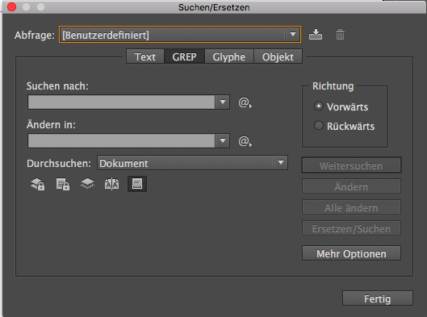
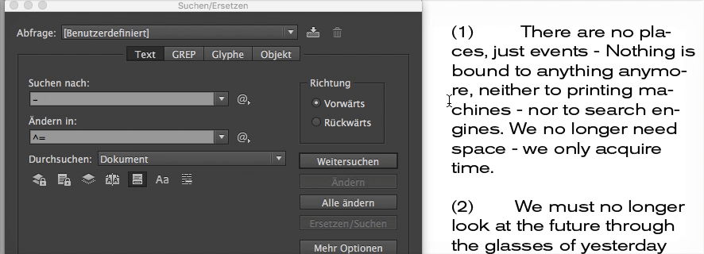
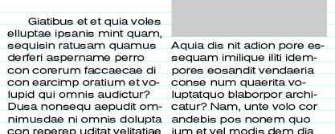
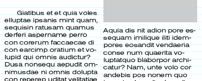
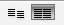
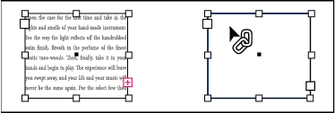
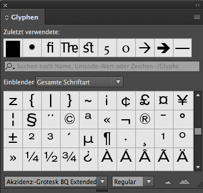

1. [Typo](#typo)
2. [Formate](#formate)
3. [Nützliches](#n%C3%BCtzliches)

## Typo

### Typo Kontext-Palette

### Zeichenpalette

 : Zeilenabstand

### Absatzpalette

 : Zeilenabstand vor dem Absatz

 : Zeilenabstand nach dem Absatz

---

### Suchen und Ersetzen

Durch die Funktion Suchen/Ersetzen in
InDesign können (fast) alle Objekte identifiziert
und durch Objekte mit anderen
grafischen Eigenschaften ersetzt werden.

Mithilfe des `@` symbols neben dem Textfeld kannst du auch sonderzeichen ersetzen:

Wie z.B könnte man alle `-` (Divis oder Viertelgeviertstrich) mit dem `—` (Gedankenstrich oder Halbgeviertstrich) ersetzen:

Du öffnest das Fenster mit `cmd + F`.

Hilfe zu Suchen/Ersetzen: [https://helpx.adobe.com/de/indesign/using/find-change.html](https://helpx.adobe.com/de/indesign/using/find-change.html)

### Grundlinienraster

Das Grundlinienraster in inDesign hilft uns Schriftzeilen auf der Vorder- und Rückseite einer Seite oder bei Spalten auf einer gemeinsamen Grundlinie stehen bzw. ein gemeinsames Grundlinienraster einhalten.

*[Link](bilder/Grundlinienraster_Musterseite.pdf) zu einem Beispiel für ein Grundlinienraster*

Mit Grundlinienraster:      | Ohne Grundlinienraster:
---|---
 | 

Das Grundlinienraster kann unter `inDesign > Voreinstellungen > Raster…` definiert werden und unter `Ansicht > Raster und Hilfslinien > Grundlinienraster einblenden` bzw. `cmd + alt + ß` eingeblendet werden.

In der Absatzpalette kann der Text dann ausgerichtet werden:

### Textverkettung

Text in einem Rahmen kann zwischen miteinander verbundenen Rahmen fließen. Um den Text zwischen verbundenen Textrahmen fließen zu lassen, musst du die Rahmen zunächst verbinden.

1. Dazu klickst du in in das kleine Quadrat recht unten im Textfeld: (hier in rot)

2. Klicken dann auf ein anderen Textrahmen oder ziehe wie mit dem Textwerkzeug einen neuen Rahmen auf.

Die verbunden Textrahmen können mit: `Ansicht > Extras > Textverkettung einblenden` oder schneller mit: `cmd + alt + Y` visualisiert werden.

Hilfe zu Textverkettung: [https://helpx.adobe.com/de/indesign/using/threading-text.html](https://helpx.adobe.com/de/indesign/using/threading-text.html)

### Glyphen

Das Bedienfeld Glyphen zeigt alle „Glyphen“
bzw. Zeichen, die die ausgewählte
Schriftfamilie enthält. Ausserdem ist es
möglich diese zu Filtern und per Klick in
ein Textfeld einzufügen.

zu finden unter `Schrift > Glyphen`

Hilfe: helpx.adobe.com/de/indesign/using/glyphs-special-characters.html

## Formate

- Zeichenformate
- Absatzformate
- Objektformate

## Nützliches:
- Schrift > Schriftart suchen…
- Textrahmenoptionen `⌘B`
- Story Editor `⌘Y`

### Kopieren von Schriftattributen
1. Klicke Sie mit dem Pipette-Werkzeug  auf den Text, der mit den Attributen formatiert ist, die du kopieren möchtest. Das Pipette-Werkzeug erscheint umgedreht und gefüllt  Wenn du die Pipette über Text positionierst, erscheint neben der geladenen Pipette ein I-Symbol .
2. Wähle den zu ändernden Text mit dem Pipette-Werkzeug aus.
Die in der Pipette geladenen Attribute werden vom markierten Text übernommen.
3. Wenn du die Pipette leeren () möchtest drücke die `alt` taste
3. Wenn du die Pipette wieder deaktivieren möchten, klicke auf ein anderes Werkzeug.
