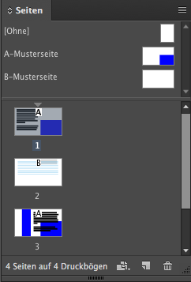
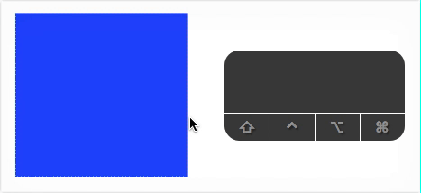

## Seiten

- Seiten anlegen und Verwalten
- Seiten Verschieben und neu Anordnen (für z.B. Folder)
- Musterseite anlegen
- Hilfslinien auf Musterseite anlegen
- Objekte auf Musterseite anlegen und einzeln im Dokument aus der Musterseite löschen
- Automatische Seitenzahl
- Grundlinienraster einstellen und anwenden
- Objekte an Hilfslinien ausrichten

### Musterseiten

Eine Mustervorlage ist wie ein Hintergrund, den man mühelos auf zahlreiche Seiten anwenden kann. Objekte auf einer Mustervorlage erscheinen auf allen Seiten, auf denen die Vorlage angewendet wird. Änderungen daran werden automatisch auf die zugehörigen Seiten angewendet. Sie enthalten meist Logos, Seitenzahlen, Kopfzeilen und Fußzeilen.

Objekte, die auf der Musterseite liegen sind normalerweise nicht zu bearbeiten. Mit `cmd + shift + Mausklick auf das Objekt` kann die verbindung zur Musterseite aufgelöst werden und die Objekte bearbeitet werden:

Du findest die Musterseiten unter `Fenster > Seiten`  und dann im oberen Bereich des Bedienfelds

Hilfe: helpx.adobe.com/de/indesign/using/master-pages.html

### Paginierung

Unter dem Reiter `Schrift > Sonderzeichen einfügen > Marken` befinden sich unter Anderem die Platzhalter für Seitenzahlen. Diese fügt man per Klick in ein angelegtes Textfeld ein und InDesign generiert automatisch die gewählte Seitenzahl. Natürlich kann man diese auch im gleichen Umfang wie Text formatieren. Besonders effektiv ist dieses Feature in Kombination mit Musterseiten.

Hilfe: https://helpx.adobe.com/de/indesign/using/layout-design-9.html

Tutorial zu Seitenzahlen in inDesign: https://www.yardo.de/tutorial/indesign/gestaltung-und-anlegenvon-seitennummerierungen/
