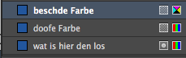
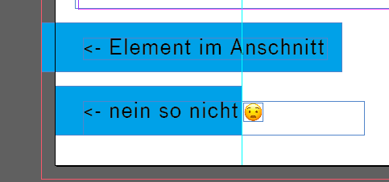

## AUSGABE

- Dokument ausdrucken (Beschnittmarken)
- PDF Vorgaben einstellen
- PDF exportieren

### Checkliste vor dem Export

#### Bilder
- Verknüpfung aktuell
  - Im Fenster »Verknüpfungen« `cmd + shift + D` kontrollieren ob gelbe
Warndreiecke auftauchen.  Mit einem Doppelklick auf das Warndreieck kannst du die Verknüpfungen aktualisierne.
- Fehlende Bilder?
  - Auch im Fenster Verknüpfungen schauen ob rote Fragezeichen
auftauchen.  Diese Bilder müssen dann neu platziert
werden.
- Auflösung der Bilder
  - Auch unter Verknüpfungen kontrollieren das die »effektive PPI« 
**über 300 PPI** liegt. In diesem fall mit 179 PPI währe das bild im Druck unscharf (bei Plakaten kannst du 100 PPI als richtwert nehmen)
- Transparenzen
  - Wenn du überdrucken Transparenzen oder Effekte benutzt hast kannst du über
`Ansicht > Überdruckenvorschau` kontrollieren ob alles stimmt

#### Farben
- Alles in CMYK
  - Die Farben (in den Farbfeldern) sollten alle auf CMYK stehen.
  - Erkennbar an dem kleinen symbol am rechten Rand:
  - 

#### Anschnitt
- Alle Objekte im Anschnitt:
  - Üblicherweise werden 3mm Anschnitt verwendet.
  - Falls ihr kein Anschnitt beim erstellen des Dokuments definiert habt: Unter `Datei > Dokument einrichten…` Anschnitt ausklappen und auf allen Seiten auf 3mm setzen.
  -  dann kontrollieren ob alle Elemente (auch Bilder und Grafiken) die den Seitenrand berühren bis zur roten Linie gehen:
  - 

### PDF Exportieren

### Datei Verpacken

Es ist sinnvoll die Datei mithilfe von `Datei > Verpacken…` für die Archivierung zu verpacken. Dabei verpackt InDesign die Datei, verwendete Schriften, Verknüpfungen wie Bilder, Textdateien und Vektoren in eine eigene Ordnerstruktur. Damit ist auch gewährleistet, dass bei der Übergabe des Projektes oder Mediums, keine Verknüpfungen fehlen - natürlich nur wenn man den kompletten Ordner versendet.

### Cheers 👌👀👌💯
