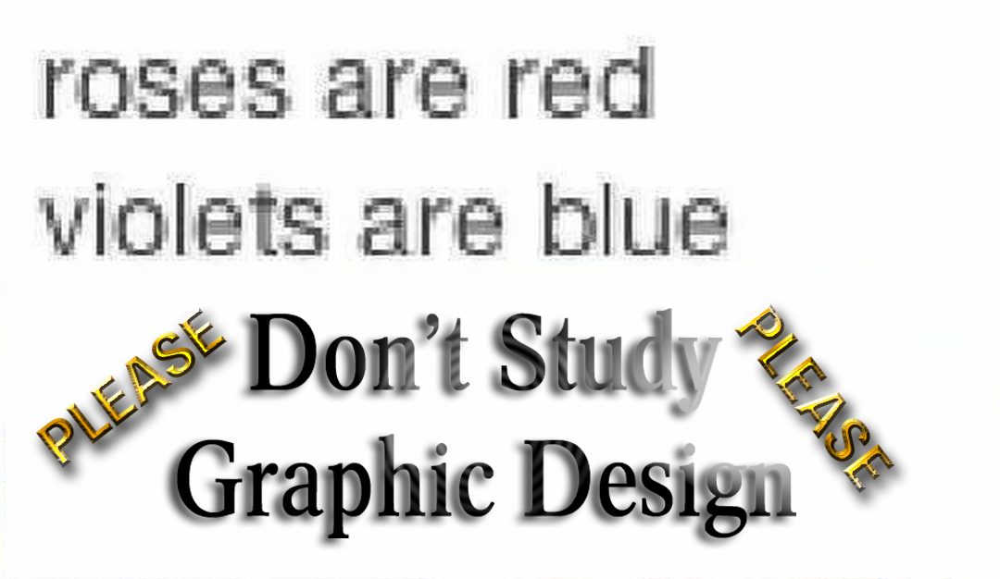

# inDesign Intro SS18 🔥
Einführung in inDesign CC2018

*Milan Gress, Hochschule Mainz 2018*

### warum inDesign?
- Layout ein- oder mehrseitiger Dokumente
- Kombinieren von Bildern mit Text und grafischen Elementen
- Exportieren von Layouts als PDFs für Druck oder Versand

## Workshop:
0. [Workspace & colormanagment](0_intro/intro.md)
1. [Basics & Layout](1_basics/basics.md)
2. [Typografie](2_typo/typo.md)
3. [Seiten](3_seiten/seiten.md)
4. [PDF & drucken](4_pdf/pdf.md)

- [Download Workshop 2](https://github.com/milangress/inDesign101/blob/master/5_workshop/workshop-2_files.zip?raw=true)
- [Download Workshop 3 ](https://github.com/milangress/inDesign101/blob/master/6_workshop/workshop_final.zip?raw=true)

## Wichtige shortcuts:

- `cmd + E` Exportieren
- `cmd + 1` 100% Ansicht
- `W` Vorschau Ansicht
- `shift + W` Präsentations Ansicht
- `cmd + alt + ß` Grundlienienraster Ein/Ausblenden
- `cmd + D` Platzieren
- `cmd + alt + shift + V` in orginalposition Einfügen
- `cmd + alt + shift + C` Rahmen proportional füllen
- `cmd + alt + shift + E` Inhalt proportional an Rahmen anpassen
- `cmd + B` Textrahmenoptionen
- `Alt + Nach-links-Taste` Kerning und Laufweite verringern
- `Alt + Nach-rechts-Taste` Kerning und Laufweite erhöhen
- `cmd + Ä` Schritt nach vorne
- `cmd + Ö` Schritt nach hinten
- `shift + pfeiltaste` um zehfachen wert verschieben

[Alle inDesign shortcuts](https://helpx.adobe.com/de/indesign/using/default-keyboard-shortcuts.html)

## Hilfe
- Lynda.com
  - Videoplattform (für Studenten kostenlos):
  - Anmelden unter [hs-mz.de/lynda](hs-mz.de/lynda)
  - [Einsteiger tutorial ca. 6 stunden](https://www.lynda.com/InDesign-tutorials/Get-started/625911/676204-4.html?org=hs-mainz.de)
  - [inDesign Formate für Fortgeschritten ca. 3 Stunden](https://www.lynda.com/InDesign-tutorials/InDesign-Styles-Depth-Revision/575947-2.html?org=hs-mainz.de)
  - [inDesign Secrets Videos (Fortgeschritten & Allgemeine Tipps)](https://www.lynda.com/InDesign-tutorials/InDesign-Secrets/85324-2.html?org=hs-mainz.de)
- [Offizielles inDesign Handbuch von Adobe](https://helpx.adobe.com/de/indesign/user-guide.html) (überaschend Hilfreich)
- [hilfdirselbst.ch](https://www.hilfdirselbst.ch/foren/Adobe_InDesign_Forum_4.html) (Deutsches Forum zu InDesign)
- [indesignsecrets.com](https://indesignsecrets.com/) (Englischer Blog über inDesign)

## Kostenlose Schriften:
  - [dafont.com](https://www.dafont.com/) / [1001freefonts.com](https://www.1001freefonts.com/)
    - Sehr viele Schriften aber oft von schlechte Qualität
  - [Google Fonts](https://fonts.google.com/)
  - [Fontsquirrel.com](https://www.fontsquirrel.com/)
  - [Page Magazine](https://page-online.de/typografie/freefont-des-monats-uebersicht/)
    - Page Online stellt jeden Monat eine qualitative hochwertigere Freefont vor.
  - [usemodify.com](https://usemodify.com/)
    - Use & Modify ist ein zusammenstellung von Open source Schriften

### Lizenz
inDesign Tutorial lizensiert unter der MIT-Lizenz.

### Good luck 💖

Grafik von [Metahaven](http://metahaven.net/)
